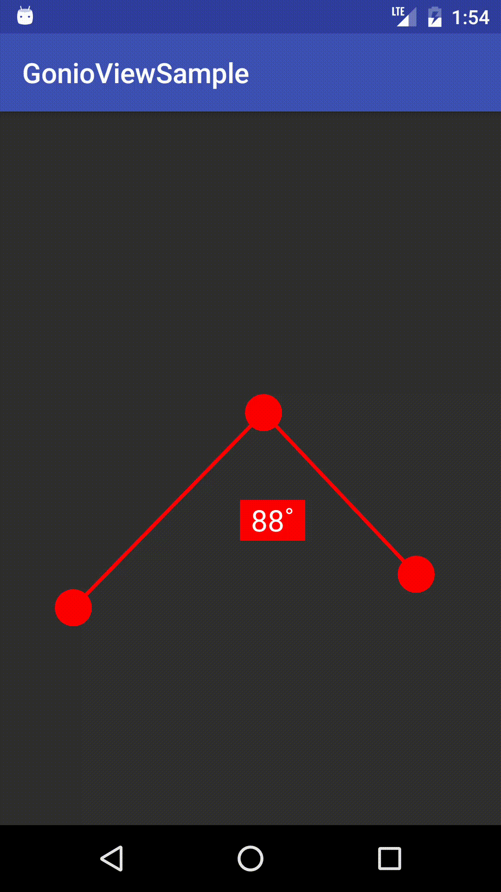

[](https://raw.githubusercontent.com/bhullnatik/gonioview/master/LICENSE)
[](https://github.com/Bhullnatik/GonioView/releases/latest)

# GonioView

Simple Android view to represent an angle (Goniometry).



## Download

Maven:
```xml
<dependency>
    <groupId>com.bhullnatik</groupId>
    <artifactId>gonioview</artifactId>
    <version>latest-version</version>
</dependency>
```

Gradle:
```groovy
compile 'com.bhullnatik:gonioview:latest-version'
```

The library currently works on Android **API 1+**. This may **change at any major version** as it's not maintainable.

## Usage

_Check the sample project for examples._

The most useful method is:

```java
int getCurrentAngle();
```
Returns the current angle (in degrees, between 0 and 180) displayed by the view.

## Roadmap

- [ ] Set angle & positions programmatically
- [ ] More options to calculate angles
- [ ] Customization (toggle text display, color, drawables for handles, ...)
- [ ] XML attributes
- [ ] ...

## Why

I needed the view and couldn't find anything like it, so I decided to open-source it. Turns out it was way easier than I thought but that's another story.
